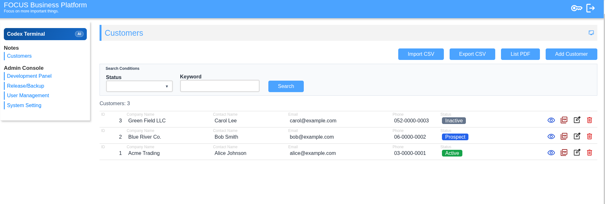
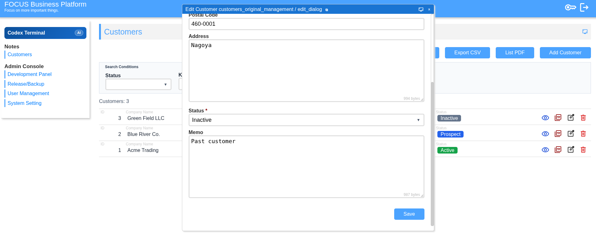

# FBP Codex Booster



> Get Codex building structured PHP business apps in minutes.

FBP Codex Booster is a ready-to-run PHP app base for Codex. Instead of asking
Codex to design everything from scratch, FBP gives it a working structure from
the first prompt.

It gives Codex a predictable place to create screens, data flows, business
actions, public pages, cron jobs, webhooks, and verification commands.

It is not another Laravel competitor. Think of it as a booster kit for AI coding:
clone it, run it, start Codex inside it, and ask Codex to build business app
features in a controlled shape.

## Try It Now

Requirements:

- PHP 8+
- Git

Run:

```bash
git clone https://github.com/focusbp/fbp-codex-booster.git
cd fbp-codex-booster
php -S 127.0.0.1:8000 router.php
```

Open:

```text
http://127.0.0.1:8000/
```

You should see the FBP login screen.

If port `8000` is already in use:

```bash
php -S 127.0.0.1:8001 router.php
```

### Windows / WSL2

On Windows, use WSL2 for the best Codex CLI experience.

```bash
sudo apt update
sudo apt install php-cli git nodejs npm
npm install -g @openai/codex

git clone https://github.com/focusbp/fbp-codex-booster.git
cd fbp-codex-booster
php -S 127.0.0.1:8000 router.php
```

## Start Codex

Open another terminal and start Codex from the repository root:

```bash
cd fbp-codex-booster
codex
```

## Make Samples

Use these prompts to have Codex generate working sample apps from the bundled
skills and assets. Start with the customer sample, then add more samples as
needed.

### Customer Management

Copy the whole block below and paste it into Codex:

```text
Read README.md and fbp/docs/.agents/skills/fbp-customer-demo/SKILL.md.
Create the default customer management demo.
Use the bundled installer and assets from the skill.
Verify the CRUD screen, seed data, CSV export, and PDF output with the FBP CLI.
```

### LINE Bot Basic

Copy the whole block below and paste it into Codex:

```text
Read README.md, fbp/docs/.agents/skills/fbp-app-samples/SKILL.md, and fbp/docs/.agents/skills/fbp-webhook/SKILL.md.
Create the LINE Bot basic sample.
Run the bundled installer: php fbp/docs/.agents/skills/fbp-app-samples/scripts/install_line_bot_basic.php.
Install the line_member DB, member_type options, line_webhook receiver, basic webhook_rule action classes, public profile page, and LINE member management screen.
Do not add LINE secrets or tokens to code.
Verify the LINE member management screen, webhook_rule list, DB schema, and PHP syntax with the FBP CLI.
```

## Generated Customer Demo

After the customer prompt above, Codex creates a customer management demo with
CRUD, CSV import/export, and PDF output.



## Generated LINE Bot Basic Sample

After the LINE Bot Basic prompt above, Codex creates a minimal LINE Bot base
with `line_member`, `line_webhook`, `webhook_rule` records, a public profile
page, and a LINE member management screen.

Configure LINE credentials in app settings, then set the LINE Messaging API
webhook path to:

```text
/line_webhook*receive
```

## Deploy To Apache

Upload these folders to the same parent directory on your Apache server:

```text
/path/to/site/
  fbp/
  classes/
```

- `fbp/` contains the framework runtime, `app.php`, assets, and `.htaccess`.
- `classes/` contains generated app code, app data, and logs.
- `.git/`, `nbproject/`, and local editor files are not needed on the server.
- `docs/`, `README.md`, and `router.php` are not required for Apache runtime.

Recommended Apache setup:

```text
DocumentRoot /path/to/site/fbp
```

Then open:

```text
https://example.com/app.php
```

If you cannot change `DocumentRoot`, upload `fbp/` and `classes/` under the same
web root and open:

```text
https://example.com/fbp/app.php
```

Make sure the PHP process can write to `classes/data` and `classes/log`.
The bundled `fbp/.htaccess` sets `app.php` as the directory index and blocks
web access to `cli.php`.

## What Codex Can Build Here

- CRUD screens for internal tools
- Customer, order, task, and workflow management
- Dashboards and admin panels
- Public pages and forms
- Webhooks and cron automation
- Email, PDF, API, LINE, and Square-connected workflows

## Why This Exists

Codex can generate code, but business applications require repeatable patterns.

FBP Codex Booster provides those patterns: routes, screens, actions, data
handling, verification commands, and skills.

The goal is not to replace developers. The goal is to give Codex a stable
environment where it can build useful business features without starting from
zero every time.

## License

MIT License.
